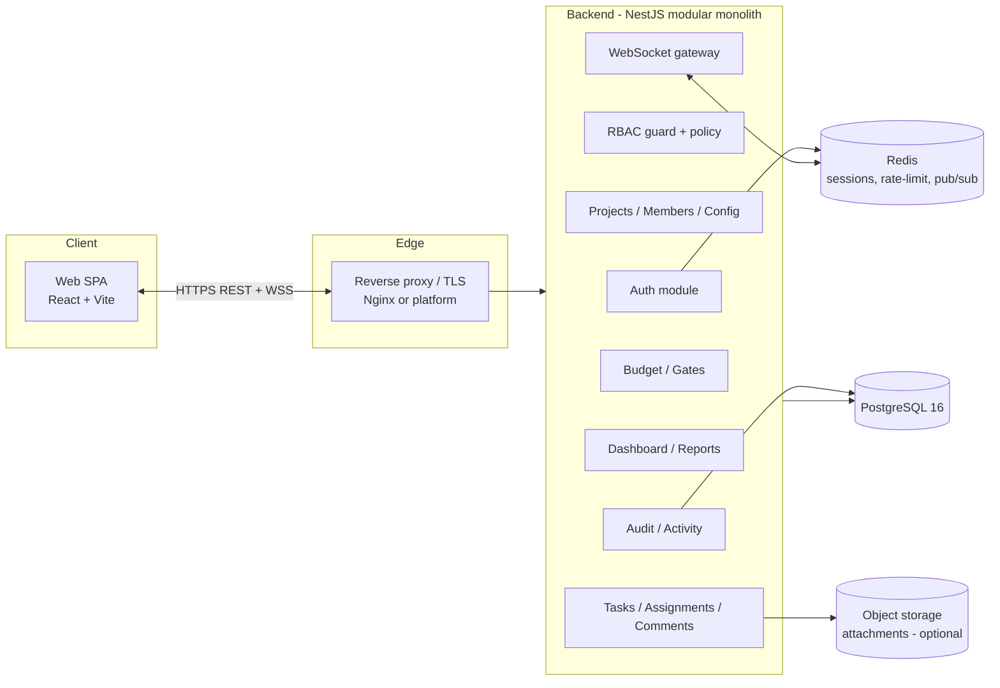
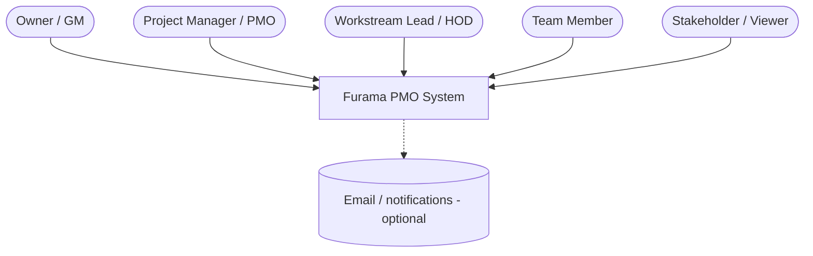
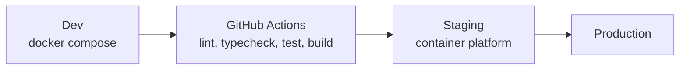

# 01 — System Design

## 1. Purpose & scope

Furama PMO manages the end-to-end opening program of a hospitality venue and supports a **cluster** of venues under one organization. It coordinates Executive/PMO governance, Marketing·PR·Sales, and Operations·SOP work tracks across a fixed timeline ending at a Grand Opening date, under a hard budget cap, with Go/No-Go gates.

In scope: authn/authz, projects & membership, configurable phases/workstreams/statuses, tasks with scheduling & assignments, progress tracking (table/board/Gantt), comments, budget rollup, milestones/gates, dashboards, audit log, real-time updates, data import/export.

Out of scope (v1): payroll, POS integration, accounting GL, native mobile apps (web is responsive).

## 2. Architecture overview

Three deployable units plus shared infra. Backend is a modular monolith (NestJS) — simplest to secure and test; can be split later.

### Why these choices
- **Modular monolith over microservices:** one deployable, one DB transaction boundary, far easier authz consistency and testing for a team-sized tool.
- **Postgres:** relational data (tasks ↔ phases ↔ workstreams ↔ members) with strong constraints, JSONB where flexible config is needed.
- **Redis:** refresh-token/session store, rate limiting, and WebSocket fan-out across instances.
- **Prisma:** type-safe queries (eliminates SQL-injection class), migration history, schema as source of truth.

## 3. C4 — Context

## 4. Component responsibilities

| Module | Responsibility | Key collaborators |
|---|---|---|
| **Auth** | Register/login, password hashing (Argon2id), JWT issue, refresh rotation, logout, password reset | Redis, Users, Audit |
| **RBAC** | Resolve caller's role per project; enforce role + resource-scope policies via guards/decorators | every module |
| **Users** | Global user profiles | Auth, Members |
| **Projects** | Project (one venue opening) CRUD, org scoping, project meta (dates, budget cap) | Members, Config |
| **Members** | Per-project membership + role + workstream scope for LEAD | RBAC |
| **Config** | Phases, workstreams, statuses, priorities, budget categories per project | Tasks, Budget |
| **Tasks** | Task CRUD, scheduling, assignments, status/percent transitions, dependencies | Config, Audit, WS |
| **Comments** | Threaded discussion on tasks | Tasks, Audit, WS |
| **Budget** | Category planned vs task-committed vs actual rollups; cap checks | Tasks, Config |
| **Gates/Milestones** | Go/No-Go gates and milestones with readiness state | Tasks |
| **Dashboard/Reports** | Aggregations: health, progress by phase/workstream, upcoming deadlines, exports | Tasks, Budget |
| **Audit/Activity** | Append-only log of all mutations; activity feed | all |
| **WebSocket** | Per-project rooms; broadcast task/comment/budget changes to authorized members | Redis pub/sub |

## 5. Non-functional requirements

| Attribute | Target |
|---|---|
| Performance | P95 API < 250 ms for list/detail at 1k tasks/project; dashboard aggregation < 500 ms (use indexed queries + materialized counts where needed) |
| Scalability | Horizontal API scaling behind LB; WS fan-out via Redis; DB read replicas later |
| Availability | Stateless API (state in PG/Redis); graceful shutdown; health/readiness probes |
| Security | See `docs/06-security.md`; OWASP Top-10 mitigated; least-privilege RBAC |
| Auditability | Every mutation produces an immutable audit row |
| Observability | Structured JSON logs (pino), request IDs, metrics endpoint, error tracking hook |
| i18n | UI strings externalized; VI default, EN secondary; dates/numbers locale-aware |
| Accessibility | Keyboard nav, focus states, reduced-motion, WCAG AA contrast |
| Data portability | JSON export/import; seed importer for Excel-derived data |

## 6. Environments & deployment

- **Config** via env vars validated at boot (fail fast on missing/invalid). See `.env.example`.
- **Migrations** run as a pre-deploy step (`prisma migrate deploy`), never auto-migrate at runtime in prod.
- **Secrets** from the platform secret manager, never in images.
- **Backups** nightly logical dump + PITR; restore drills documented.

## 7. Key design decisions (ADR summary)

| ID | Decision | Rationale | Alternative rejected |
|---|---|---|---|
| ADR-1 | Modular monolith | Simplicity, transactional integrity, authz consistency | Microservices (premature) |
| ADR-2 | RBAC with per-workstream scope for LEAD | Matches real org structure (a Marketing lead ≠ Operations lead) | Flat global roles |
| ADR-3 | Free-text assignee label + optional user link | Source data uses role-name strings; allows gradual user mapping | Hard FK only (would block import) |
| ADR-4 | Refresh-token rotation w/ family revocation | Detects token theft/replay | Long-lived JWT (insecure) |
| ADR-5 | Money as BigInt VND | Exact, no float error | Decimal/float |
| ADR-6 | Append-only audit table | Tamper-evident history, compliance | Mutable "updatedBy" only |
