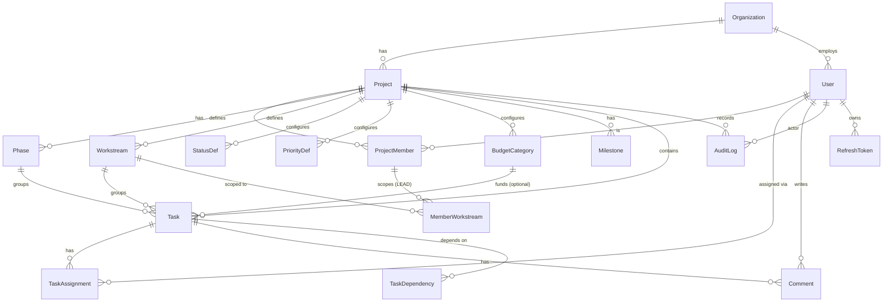

# 02 — Data Model

Source of truth is `prisma/schema.prisma`. This document explains it. Equivalent raw DDL is in `db/schema.sql`.

## 1. ERD



## 2. Entities

### Organization
The tenant. Owns users and projects. Enables the **restaurant-cluster** use case (many venues under one org).
`id, name, slug (unique), createdAt`

### User
Global identity within an org. Authentication subject.
`id, orgId, email (unique per org), name, passwordHash, avatarColor, isActive, lastLoginAt, createdAt`
- `passwordHash` = Argon2id. Never returned by the API.

### Project
One restaurant opening initiative.
`id, orgId, name, location, status (ProjectStatus), startDate, endDate, openingDate, budgetCapVnd (BigInt), createdById, createdAt, archivedAt?`

### ProjectMember
Join of User × Project with a role. The authorization anchor.
`id, projectId, userId, role (MemberRole), memberLabel?, createdAt`
- `memberLabel`: the free-text name used in task assignment strings (e.g., "Design Lead"), used to auto-link assignments and to scope MEMBER permissions. Unique per project when set.
- Unique constraint: `(projectId, userId)`.

### MemberWorkstream
Scopes a `LEAD` to specific workstreams (a Marketing lead manages Marketing only).
`id, projectMemberId, workstreamId` — unique `(projectMemberId, workstreamId)`.

### Phase
Ordered program stage (e.g., "P1 - Foundation 01-10 Jul").
`id, projectId, name, order, startDate?, endDate?` — unique `(projectId, name)`.

### Workstream
A track/department (e.g., "Branding & Design"). Grouped by a high-level `track`.
`id, projectId, name, track (WorkstreamTrack), order` — unique `(projectId, name)`.

### StatusDef / PriorityDef
Configurable enumerations per project (label + color + order). Tasks reference by label within the project; the system also validates against these.
`id, projectId, key, color, order, isTerminal(bool, for StatusDef)`

### BudgetCategory
Planned budget buckets per project (from the playbook: Branding 80M, Digital Ads 250M, …).
`id, projectId, name, ownerLabel, plannedVnd (BigInt), order`

### Task — central entity
`id, projectId, code (WBS, unique per project), title, description,`
`phaseId, workstreamId, category, budgetCategoryId?,`
`startDate?, deadline?, durationDays?,`
`priority (Priority), status (TaskStatus), percent (0-100),`
`budgetVnd (BigInt, default 0), actualVnd (BigInt, default 0),`
`kpi, deliverable, dependencyText, riskText, audience, notes,`
`createdById, updatedById?, createdAt, updatedAt`
- `inCharge/support/approver` are modeled as `TaskAssignment` rows (see below) but a denormalized `inChargeLabel` may be kept for fast list rendering and import fidelity.
- Invariants enforced in service layer: `status=COMPLETED ⇒ percent=100`; `percent=100 ⇒ status=COMPLETED`; `0<percent<100 & status=NOT_STARTED ⇒ status=IN_PROGRESS`.

### TaskAssignment
`id, taskId, userId?, label, role (AssignmentRole)`
- `role`: IN_CHARGE | SUPPORT | APPROVER. `userId` optional (label-only until mapped to a real user). Used by RBAC to grant MEMBER edit rights.

### TaskDependency
`id, taskId, dependsOnTaskId` — unique `(taskId, dependsOnTaskId)`; no self-reference; cycle check in service.

### Comment
`id, taskId, authorId, body, createdAt`

### Milestone (includes Go/No-Go gates)
`id, projectId, name, date, type (MilestoneType: MILESTONE|GATE), status (GateStatus: PENDING|PASSED|FAILED|NA), criteria(JSONB), notes`

### AuditLog (append-only)
`id, projectId?, actorId, action, entityType, entityId, before(JSONB?), after(JSONB?), ip, userAgent, createdAt`
- No update/delete permitted (enforced by app + DB role privileges).

### RefreshToken (rotation + theft detection)
`id, userId, familyId, tokenHash, expiresAt, revokedAt?, replacedById?, createdByIp, createdAt`

## 3. Enums

```
ProjectStatus    = PLANNING | ACTIVE | OPENING | CLOSED | ARCHIVED
MemberRole       = OWNER | PM | LEAD | MEMBER | VIEWER
WorkstreamTrack  = PMO | MARKETING | OPERATIONS
TaskStatus       = NOT_STARTED | IN_PROGRESS | IN_REVIEW | BLOCKED | COMPLETED
Priority         = CRITICAL | HIGH | MEDIUM | LOW
AssignmentRole   = IN_CHARGE | SUPPORT | APPROVER
MilestoneType    = MILESTONE | GATE
GateStatus       = PENDING | PASSED | FAILED | NA
```
> `StatusDef`/`PriorityDef` allow per-project custom labels/colors **on top of** the canonical enums; the enum is the stored value, the def supplies display + ordering + extensibility. If a project adds a fully custom status, store it in `StatusDef` and relax the Task.status to a validated string referencing StatusDef.key. (Decision: v1 keeps the fixed enum + per-project color/label override for simplicity; document if you change this.)

## 4. Indexing strategy

| Table | Index | Why |
|---|---|---|
| task | `(projectId, status)` | board columns, status filters |
| task | `(projectId, deadline)` | upcoming-deadline & overdue scans |
| task | `(projectId, phaseId)` / `(projectId, workstreamId)` | grouped views (Gantt, dashboards) |
| task | `(projectId, code)` unique | WBS lookups, import idempotency |
| task_assignment | `(userId)`, `(taskId)` | "my tasks", task detail |
| comment | `(taskId, createdAt)` | thread load |
| audit_log | `(projectId, createdAt)`, `(entityType, entityId)` | activity feed, entity history |
| project_member | `(projectId, userId)` unique, `(userId)` | authz lookups, "my projects" |
| refresh_token | `(tokenHash)` unique, `(userId)`, `(familyId)` | rotation/revocation |

## 5. Referential & integrity rules

- All child rows `ON DELETE CASCADE` from `project` **except** `audit_log` (retain history; nullable projectId on project delete or soft-delete projects instead — prefer soft-delete via `archivedAt`).
- `task.percent` CHECK between 0 and 100.
- Money columns CHECK `>= 0`.
- Unique `(projectId, code)` makes seed import idempotent (upsert by code).
- Soft-delete projects (`archivedAt`) rather than hard delete to preserve audit integrity.

## 6. Seed data format

`db/seed/tasks.seed.json` is columnar-packed to stay compact:
```json
{ "cols": ["id","project","phase","workstream","category","title","description",
            "inCharge","support","approver","start","deadline","duration","priority",
            "status","percent","budget","actual","kpi","deliverable","dependency",
            "risk","audience","notes"],
  "rows": [ ["EXE-0001","PMO","P0 - Executive Setup","PMO","Governance","Executive kick-off", ... ] ] }
```
Importer mapping: `project` (PMO/MKT/OPS) → seed Workstream.track + a default Project; create Phase/Workstream on first sight; `inCharge/support/approver` → TaskAssignment rows (label-only, link to ProjectMember by `memberLabel` when present); `budget/actual` → BigInt VND; `code = id`. Upsert by `(projectId, code)`.
