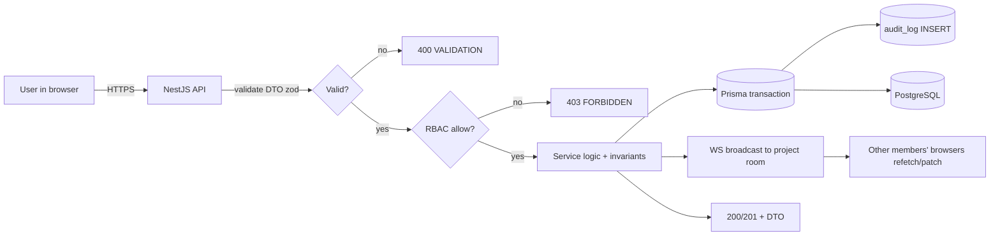
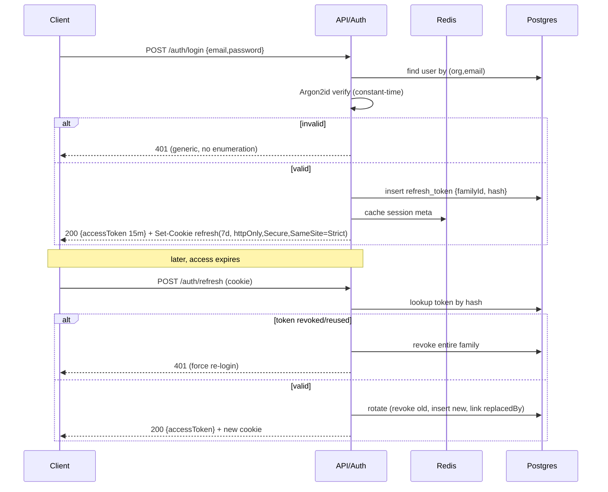
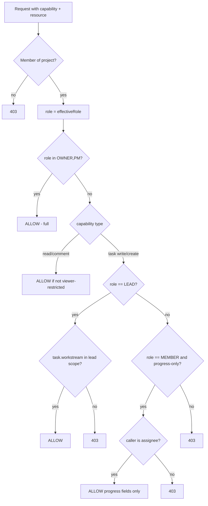
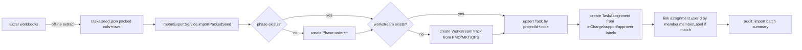
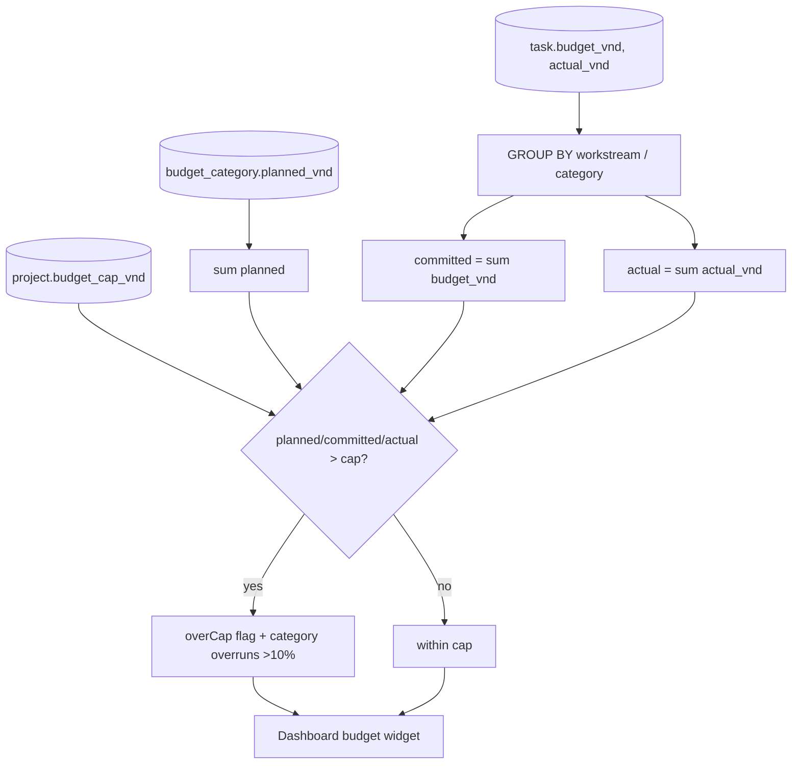
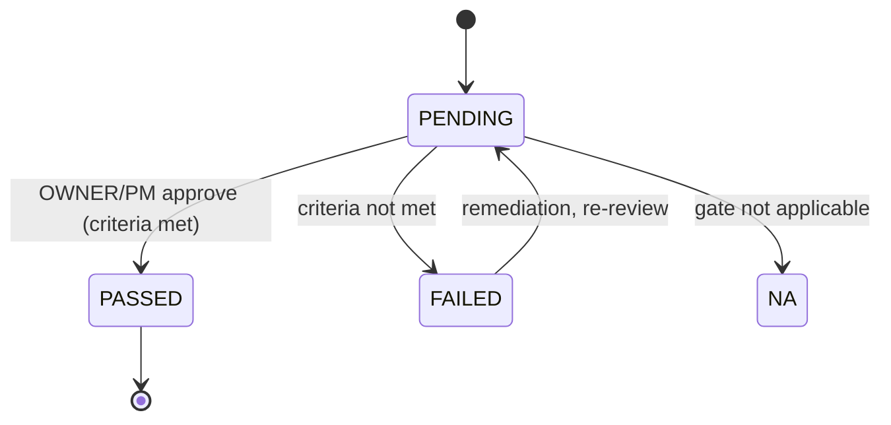
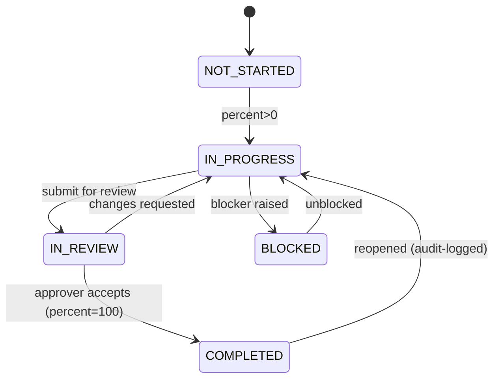

# 05 — Data Flows & Workflows

Diagrams below are the behavioral contract. Implement flows to match; tests in `docs/07` reference these.

## 1. End-to-end data flow (context)



## 2. Login + refresh rotation (sequence)



## 3. RBAC authorization decision (flowchart)



## 4. Task progress update + realtime (sequence)

```mermaid
sequenceDiagram
  participant C as Client (Lead/Member)
  participant API as TaskService
  participant DB as Postgres
  participant WS as WS Gateway
  C->>API: PATCH /tasks/:id/progress {status, percent}
  API->>API: assertCan(updateProgress, task)
  API->>API: apply invariants (status<->percent)
  API->>DB: BEGIN; update task; insert audit; COMMIT
  API->>WS: emit task.progress to project:{pid}
  API-->>C: 200 {task}
  WS-->>C: (others) patch board/list optimistic cache
```

## 5. Seed / Excel import pipeline (flowchart)



## 6. Budget rollup (data flow)



## 7. Go/No-Go gate state machine


Gate readiness is computed from linked tasks (e.g., "Ads live, QR active, POSM in production"): the UI shows % of criteria tasks `COMPLETED`; only OWNER/PM may set `PASSED`/`FAILED`.

## 8. Task lifecycle (state)


